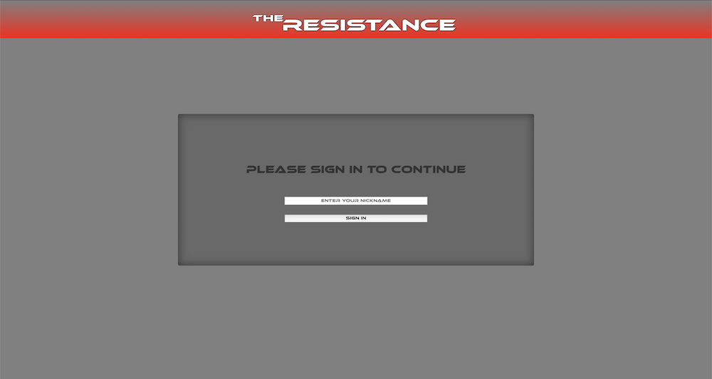
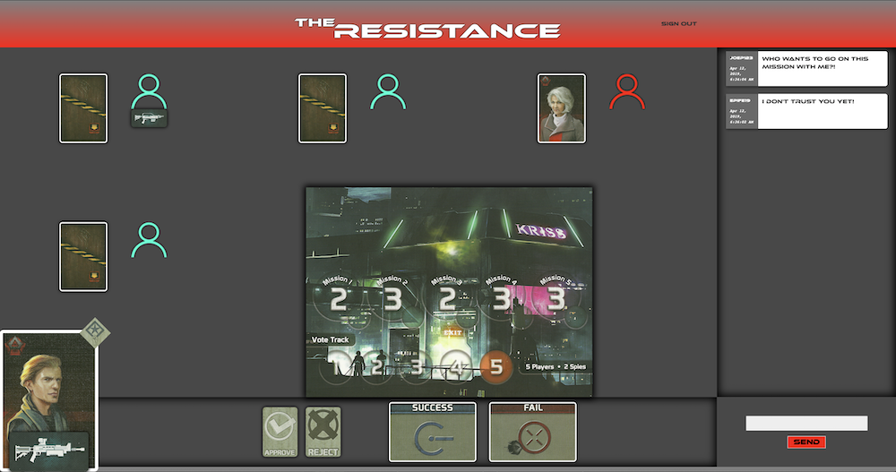
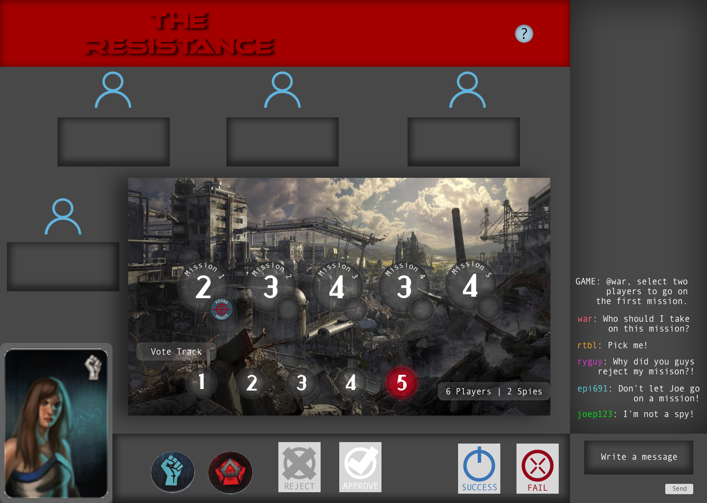
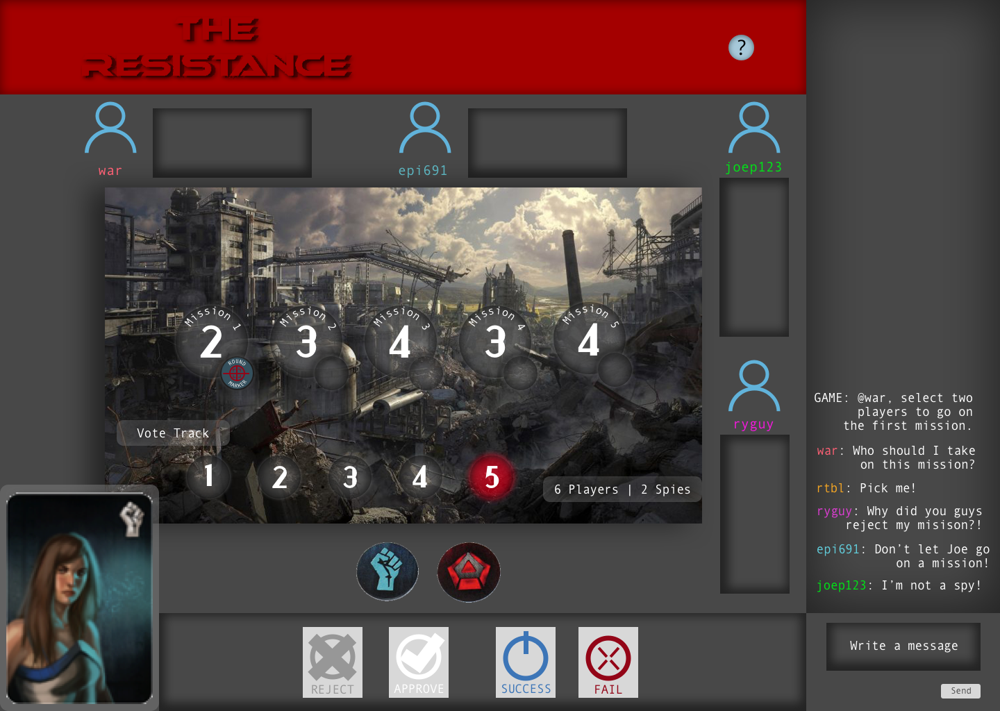

# The Resistance Board Game

#### _JavaScript Team Week Project, 04.9.19_

#### By: _**Leo Mangutov, Ward Chamberlain, Riley Benson, Randee Layosa, and Joe Pritchett**_

## Description

_This is an online version of the game The Resistance. The game's premise involves a war between government and resistance groups in which players are assigned various roles related to said groups. Like other deductive reasoning party games, The Resistance relies on certain players attempting to disrupt the larger group working together, while the rest of the players work to reveal the spy working against them. This game requires a minimum of 5 players and a maximum of 10._

## Preview
<p align="center">Login Landing Page | Private Game Room</p>
<p align="center">


</p>

## Setup/Installation Requirements
_This project was generated with [Angular CLI](https://github.com/angular/angular-cli) version 1.6.5._

1. Clone this GitHub repository https://github.com/joepritch/resistance-game.git to your Desktop.
  * Install git onto your computer if it isn't already.
  * To clone the project down to your desktop, open your Terminal, and enter the following commands:
  ```
  cd desktop
  git clone [paste link here]
  cd desktop/[project folder name]
  atom .
  npm install
  ```
  * _You can use another text editor if Atom is not your preferred program._
  * _Make sure a "node_modules" and "dist" folder are created in your project file. If it hasn't, run `npm install` again._
  * _You can then go to the link in step 1 above, or continue on to the following instructions to run the server._

#### Running the server to view the live project
* Run `ng serve` in the project directory in Terminal. Go to http://localhost:4200/ in the browser of your choice. _Note: The app will automatically reload if you change any of the source files._

#### Further help

To get more help on the Angular CLI use `ng help` or go check out the [Angular CLI README](https://github.com/angular/angular-cli/blob/master/README.md).

## Planning and Specifications

  | Configuration/Dependencies | Use |
| :-------------     | :------------- |
| Angular | framework |
| Clean-Webpack-Plugin | clears project dist folder |
| CSS-Loader, Style-Loader, Sass-Loader, Node-Sass | styling |
| ESLint | JavaScript linter, checks code for errors |
| File-Loader | image loader |
| HTML-Webpack-Plugin | loads HTML file |
| Jasmine, Karma | for testing code |
| Typescript | programming language |
| UglifyJS-Webpack-Plugin | minifies code |
| Webpack | bundles/compiles code |

**Sketch Wireframes**

<p align="center">


</p>

**Features Built and To Be Completed**
- [x] Navigation bar component
- [x] Game Room component with live/private chat
- [x] Chat component
- [x] Anonymous authentication
- [x] Game Room generator upon login
- [x] Link share capability for multiple players in same room
- [x] Database stores User ID and Game Room ID
- [ ] Game aspect is functioning and playable
- [ ] Sass animations on game pieces
- [ ] Game is able to handle 5-10 players
- [ ] Expiration on game room to delete when a game is completed

## Technologies Used

* _HTML_
* _CSS_
* _Bootstrap_
* _Atom_
* _JavaScript_
* _jQuery_
* _NPM_
* _Webpack_
* _Jasmine_
* _Karma_
* _Angular_
* _Firebase_

## Support and contact details

_If you have any questions contact us at:_
_<a href="mailto:leo.mangutov@gmail.com">Leo Mangutov</a>_


### License

* Permission is hereby granted, free of charge, to any person obtaining a copy
of this software and associated documentation files (the "Software"), to deal
in the Software without restriction, including without limitation the rights
to use, copy, modify, merge, publish, distribute, sublicense, and/or sell
copies of the Software, and to permit persons to whom the Software is
furnished to do so, subject to the following conditions:

* The above copyright notice and this permission notice shall be included in all
copies or substantial portions of the Software.

* THE SOFTWARE IS PROVIDED "AS IS", WITHOUT WARRANTY OF ANY KIND, EXPRESS OR
IMPLIED, INCLUDING BUT NOT LIMITED TO THE WARRANTIES OF MERCHANTABILITY,
FITNESS FOR A PARTICULAR PURPOSE AND NONINFRINGEMENT. IN NO EVENT SHALL THE
AUTHORS OR COPYRIGHT HOLDERS BE LIABLE FOR ANY CLAIM, DAMAGES OR OTHER
LIABILITY, WHETHER IN AN ACTION OF CONTRACT, TORT OR OTHERWISE, ARISING FROM,
OUT OF OR IN CONNECTION WITH THE SOFTWARE OR THE USE OR OTHER DEALINGS IN THE
SOFTWARE.

Copyright (c) 2019 **_Leo Mangutov, Ward Chamberlain, Riley Benson, Randee Layosa, and Joe Pritchett_**
